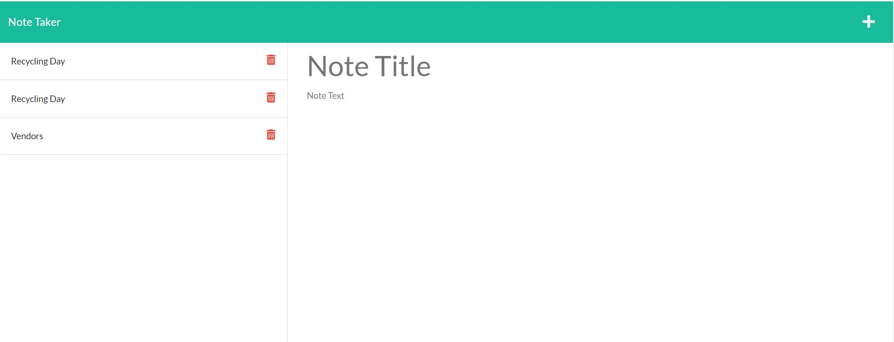

# nifty-notetaker

# Description
  The client side was already setup and I had to make the server talk to the client by doing a GET and POST request for the application. This is a note application that allows business owners to take notes throughout the day. 

[link to deployed Heroku app](https://morning-wildwood-40959.herokuapp.com/notes)

[link to GitHub repository](https://github.com/Ro-Galvan/nifty-notetaker)

# Table of Contents
  - [Installation](#installation)
  - [Usage](#usage)
  - [Questions](#questions)
# Installation
  Follow the below steps: 
  Express should be installed by running npm install. Once you are server.js file you can run npm start to run the application. 
# Usage

# License
 MIT
# Questions
  Link to my github:
  https://github.com/Ro-Galvan
 
  Contact me:
  https://www.linkedin.com/in/rocio-galvan/ 
